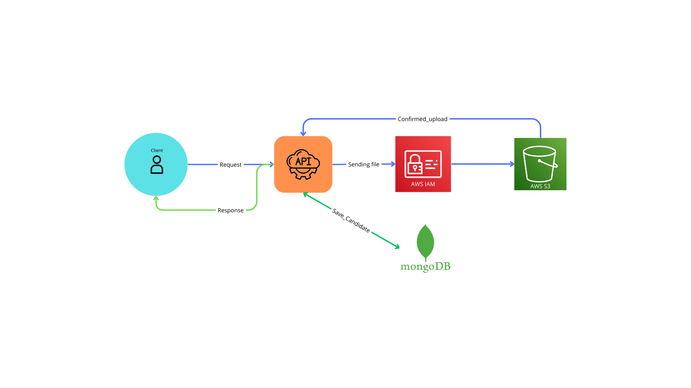

# Sistema de Candidaturas

## Descrição
Este projeto contém a implementação de um sistema de candidaturas para um processo seletivo. Nesse serviço, é possível realizar cadastros de candidatos a determinadas vagas. O objetivo desse projeto é demonstrar meus conhecimentos relacionados a desenvolvimento backend com Python, FastAPI e AWS-S3.

## Dependências
Segue a lista das dependências utilizadas nesse projeto (podendo ser vistas também no arquivo `requirements.txt`):
- annotated-types
- anyio
- boto3
- botocore
- click
- colorama
- dnspython
- email_validator
- fastapi
- h11
- idna
- iniconfig
- jmespath
- motor
- packaging
- pluggy
- pydantic
- pydantic-settings
- pydantic_core
- pymongo
- pytest
- python-dateutil
- python-dotenv
- python-multipart
- s3transfer
- six
- sniffio
- starlette
- typing_extensions
- urllib3
- uvicorn

## AWS-S3
Neste projeto, foi utilizado o serviço da AWS-S3 para armazenar os currículos dos candidatos. Porém, para que o sistema funcione corretamente, é necessário configurar as variáveis de ambiente e as credenciais da AWS. Em relação às variáveis de ambiente, é necessário criar um arquivo `.env` na raiz do projeto com as seguintes informações (que podem ser vistas no arquivo `example_env`):
```
AWS_BUCKET_NAME=your_bucket_name
AWS_REGION=us-east-1

MONGODB_URI=mongodb://localhost:27017
MONGODB_DB_NAME=DB_NAME
MONGODB_COLLECTION_NAME=COLLECTION_NAME
AWS_PROFILE_NAME=your_profile_name
```

Em relação às credenciais da AWS, é necessário que você configure um perfil com as credenciais necessárias para utilizar a AWS-S3. Para isso, use o comando `aws configure --profile your_profile_name` e insira as informações solicitadas. Essa é uma forma mais segura de utilizar as credenciais da AWS, pois evita que você insira essas informações diretamente no código. No arquivo ./app/core/config.py, estão configuradas as variáveis de ambiente que serão utilizadas para o acesso ao AWS-S3 e ao MongoDB e no arquivo ./app/services/aws_s3_service.py, está a implementação do serviço de upload de arquivos para o AWS-S3.

## Execução
Para executar o projeto, é necessário criar um ambiente virtual e instalar as dependências. Para isso, execute os seguintes comandos:
```
python3 -m venv venv
source venv/bin/activate # Linux
venv\Scripts\activate # Windows
pip install -r requirements.txt
```

Após a instalação das dependências, execute o seguinte comando para iniciar o servidor:
```
uvicorn app.main:app --reload
```

## Testes
Na atual versão do projeto, não foram implementados testes automatizados. Porém, pretendo implementá-los em versões futuras.

## Docker
Neste projeto, há um arquivo `Dockerfile` que contém as instruções para a criação da imagem docker do sistema. Para criar a imagem, execute o seguinte comando:

```bash
docker build -t candidaturas .
```

Após a criação da imagem, execute o seguinte comando para iniciar o container:
```bash
docker run -d -p 8000:8000 candidaturas
```


## Rotas e Documentação da API
No projeto, foram implementadas as seguintes rotas:

## Arquitetura do projeto
Na imagem abaixo é possível visualizar a arquitetura do projeto:




### Endpoint 1: Upload de arquivos(CV dos candidatos)

### **POST** `/api/v1/upload`

Este endpoint é utilizado para fazer o upload de arquivos para o AWS-S3. Ele aceita arquivos do tipo .pdf e retorna a URL do arquivo carregado.

### Formato da Requisição
- **Content-Type**: `multipart/form-data`
- **Request Body**:
  - `file` (required): O arquivo a ser carregado.

#### Exemplo de Requisição
```http
POST /api/v1/upload HTTP/1.1
Host: example.com
Content-Type: multipart/form-data

--boundary
Content-Disposition: form-data; name="file"; filename="example_resume.pdf"
Content-Type: application/pdf

(binary content of the file)
--boundary--
```

### Formato da Resposta
- **Status Code**: `200 OK`
- **Response Body** (JSON):
  - `file_url` (string): O URL do arquivo carregado.

#### Exemplo de Resposta
```json
{
  "file_url": "https://example-bucket.s3.amazonaws.com/example_resume.pdf"
}
```

---

## Endpoint 2: Salvando informações de um candidato

### **POST** `/api/v1/candidatos/save_candidato`

Esse endpoint é utilizado para salvar as informações de um candidato no banco de dados, salvando o currículo no AWS-S3 e retornando as informações do candidato salvo.

### Request Format
- **Content-Type**: `multipart/form-data`
- **Request Body**:
  - `nome` (required, string): O nome do candidato.
  - `email` (required, string): O email do candidato.
  - `telefone` (required, string): O telefone do candidato.
  - `cidade` (required, string): A cidade do candidato.
  - `estado` (required, string): O estado do candidato.
  - `pais` (required, string): O país do candidato.
  - `linkedin` (optional, string): O URL do perfil do LinkedIn do candidato.
  - `portfolio` (optional, string): O URL do portfólio do candidato.
  - `pretensao_salarial` (optional, number): A pretensão salarial do candidato.
  - `area_interesse` (optional, string): A área de interesse profissional do candidato.
  - `curriculo` (required, file): O currículo do candidato.

#### Exemplo de Requisição
```http
POST /api/v1/candidatos/save_candidato HTTP/1.1
Host: example.com
Content-Type: multipart/form-data

--boundary
Content-Disposition: form-data; name="nome"

John Doe
--boundary
Content-Disposition: form-data; name="email"

john.doe@example.com
--boundary
Content-Disposition: form-data; name="telefone"

+55 11 99999-9999
--boundary
Content-Disposition: form-data; name="cidade"

São Paulo
--boundary
Content-Disposition: form-data; name="estado"

SP
--boundary
Content-Disposition: form-data; name="pais"

Brasil
--boundary
Content-Disposition: form-data; name="linkedin"

https://linkedin.com/in/johndoe
--boundary
Content-Disposition: form-data; name="portfolio"

https://github.com/johndoe
--boundary
Content-Disposition: form-data; name="pretensao_salarial"

10000.00
--boundary
Content-Disposition: form-data; name="area_interesse"

Software Development
--boundary
Content-Disposition: form-data; name="curriculo"; filename="john_doe_resume.pdf"
Content-Type: application/pdf

(binary content of the file)
--boundary--
```

### Formato da Resposta
- **Status Code**: `201 Created`
- **Response Body** (JSON):
  - `id` (string): O ID do candidato.
  - `nome` (string): O nome do candidato.
  - `email` (string): O email do candidato.
  - `telefone` (string): O telefone do candidato.
  - `cidade` (string): A cidade do candidato.
  - `estado` (string): O estado do candidato.
  - `pais` (string): O país do candidato.
  - `linkedin` (string): O URL do perfil do LinkedIn do candidato.
  - `portfolio` (string): O URL do portfólio do candidato.
  - `pretensao_salarial` (number): A pretensão salarial do candidato.
  - `area_interesse` (string): A área de interesse profissional do candidato.
  - `curriculo_url` (string): O URL do currículo do candidato.
  - `created_at` (string): O timestamp da criação.
  - `updated_at` (string): O timestamp da última atualização.

#### Example Response
```json
{
  "id": "abc123",
  "nome": "John Doe",
  "email": "john.doe@example.com",
  "telefone": "+55 11 99999-9999",
  "cidade": "São Paulo",
  "estado": "SP",
  "pais": "Brasil",
  "linkedin": "https://linkedin.com/in/johndoe",
  "portfolio": "https://github.com/johndoe",
  "pretensao_salarial": 10000.00,
  "area_interesse": "Software Development",
  "curriculo_url": "https://example-bucket.s3.amazonaws.com/john_doe_resume.pdf",
  "created_at": "2024-12-13T20:48:36.149946+00:00",
  "updated_at": "2024-12-13T20:48:36.149946+00:00"
}
```

> **Nota**: Você também pode acessar a documentação da API em `http://localhost:8000/docs`.

## Desenvolvedor
- Alysson Araújo
  - Linkedin: [www.linkedin.com/in/alysson-alexandre](https://www.linkedin.com/in/alysson-alexandre)
  - GitHub: [https://github.com/Alysson-Araujo](https://github.com/Alysson-Araujo)